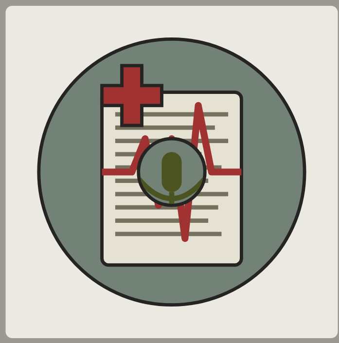

# TCCC.ai Imagery and Icons Guide

This document provides guidance on the visual identity for the TCCC.ai project, including text-to-image prompts for generating consistent imagery and vector graphic specifications for icons used in the application.

## Text-to-Image Prompt for TCCC.ai System Visualization

Use the following prompt with text-to-image generation tools (like Midjourney, DALL-E, or Stable Diffusion) to create consistent imagery for documentation, presentations, and marketing materials:

```
A photorealistic image of the TCCC.ai medical documentation system in a tactical military environment. The system consists of a rugged NVIDIA Jetson Orin Nano device with a small 7-inch e-ink display in a protective olive drab case. A Razor Mini 3 USB-C microphone extends from the top. The system is being used by a combat medic tending to a casualty under cover. The display shows medical documentation being generated in real-time from spoken audio. The scene is dimly lit with high contrast lighting, conveying urgency but professionalism. The overall aesthetic is modern tactical medical technology, emphasizing reliability and precision. Include subtle military medical symbols like a small Caduceus or cross integrated into the design.
```

## Vector Graphics Specifications

### Primary TCCC.ai Logo (SVG)

```svg
<svg xmlns="http://www.w3.org/2000/svg" viewBox="0 0 500 500">
  <!-- Background -->
  <rect width="500" height="500" fill="#ebeae2" rx="10" ry="10" />
  
  <!-- Main Circle - Using microphone green color -->
  <circle cx="250" cy="250" r="200" fill="#738276" stroke="#252422" stroke-width="5" />
  
  <!-- E-ink Display/Screen -->
  <rect x="145" y="130" width="210" height="260" rx="10" ry="10" fill="#e6e2d3" stroke="#252422" stroke-width="5" />
  
  <!-- Text Lines on Display -->
  <rect x="165" y="160" width="170" height="6.5" fill="#75715e" />
  <rect x="165" y="180" width="150" height="6.5" fill="#75715e" />
  <rect x="165" y="200" width="170" height="6.5" fill="#75715e" />
  <rect x="165" y="220" width="130" height="6.5" fill="#75715e" />
  <rect x="165" y="240" width="160" height="6.5" fill="#75715e" />
  <rect x="165" y="260" width="140" height="6.5" fill="#75715e" />
  <rect x="165" y="280" width="170" height="6.5" fill="#75715e" />
  <rect x="165" y="300" width="155" height="6.5" fill="#75715e" />
  <rect x="165" y="320" width="140" height="6.5" fill="#75715e" />
  <rect x="165" y="340" width="160" height="6.5" fill="#75715e" />
  
  <!-- Small Medical Cross -->
  <path d="M145 120 L175 120 L175 90 L205 90 L205 120 L235 120 L235 150 L205 150 L205 180 L175 180 L175 150 L145 150 Z" fill="#a03232" stroke="#252422" stroke-width="5" />
  
  <!-- EKG Line -->
  <path d="M145 250 
           L190 250 
           L210 200 
           L230 300 
           L250 200 
           L270 350 
           L290 150 
           L310 250 
           L355 250" 
        fill="none" stroke="#a03232" stroke-width="10.4" stroke-linejoin="round" />
  
  <!-- Microphone with clipping mask -->
  <defs>
    <clipPath id="micMask">
      <circle cx="250" cy="250" r="48" />
    </clipPath>
  </defs>
  
  <!-- Microphone circle with proper stroke -->
  <circle cx="250" cy="250" r="50" fill="#738276" stroke="#252422" stroke-width="5" />
  
  <!-- Microphone elements with clipping mask -->
  <g clip-path="url(#micMask)">
    <rect x="235" y="220" width="30" height="60" rx="15" ry="15" fill="#4b5320" />
    <path d="M200 260 Q250 320 300 260" fill="none" stroke="#4b5320" stroke-width="7.8" />
    <path d="M250 280 L250 310" fill="none" stroke="#4b5320" stroke-width="7.8" />
  </g>
</svg>
```

### Color Palette

The TCCC.ai project uses the following consistent color palette across all visual elements:

1. **Primary Colors**
   - Military Olive: `#4b5320` - Used for primary UI elements and accents
   - Tactical Green: `#738276` - Used for backgrounds and containers
   - Medical Red: `#a03232` - Used for alerts, critical information, and medical symbols

2. **Secondary Colors**
   - Paper Beige: `#e6e2d3` - Used for content areas and displays
   - Text Gray: `#75715e` - Used for text and subtle UI elements
   - Dark Outline: `#252422` - Used for borders and outlines

3. **Status Colors**
   - Alert Red: `#bf3636` - Critical alerts and errors
   - Caution Amber: `#d9b310` - Warnings and cautions
   - Safe Green: `#3c8a3f` - Success indicators and status "OK"

### Module-Specific Icons

Each module in the TCCC.ai system should have its own distinctive icon following these design principles:

1. **Audio Pipeline Icon**
   - Base shape: Sound wave emanating from a microphone
   - Primary color: Tactical Green (`#738276`)
   - Secondary elements: Simple directional arrows showing flow

2. **STT Engine Icon**
   - Base shape: Speech bubble transforming into text characters
   - Primary color: Tactical Green (`#738276`)
   - Secondary elements: Waveform transitioning to text

3. **Processing Core Icon**
   - Base shape: Hexagonal processor chip
   - Primary color: Tactical Green (`#738276`)
   - Secondary elements: Circuit-like lines connecting nodes

4. **LLM Analysis Icon**
   - Base shape: Brain or neural network visualization
   - Primary color: Tactical Green (`#738276`)
   - Secondary elements: Connecting nodes with data flow indicators

5. **Document Library Icon**
   - Base shape: Stack of documents or files
   - Primary color: Tactical Green (`#738276`)
   - Secondary elements: Search or retrieval indicator

6. **Data Store Icon**
   - Base shape: Database cylinder
   - Primary color: Tactical Green (`#738276`)
   - Secondary elements: Data records or tables indicator

### Implementation Guidelines

1. **Scaling**
   - All icons should scale well from 16x16px to 512x512px
   - Maintain consistent stroke widths relative to icon size (approximately 1-2% of the total width)
   - Use vector formats (SVG) whenever possible

2. **Accessibility**
   - Ensure sufficient contrast between elements (minimum 4.5:1 ratio)
   - Design icons to be recognizable even in grayscale
   - Include text labels alongside icons in the UI

3. **Integration**
   - Icons should be exported as SVG for web interfaces
   - For documentation, provide high-resolution PNG versions (at least 300dpi)
   - Maintain consistent padding around icons (approximately 10% of the total size)

## Logo Variants

### Monochrome Version

A simplified, single-color version of the logo for use in limited color situations:

```svg
<svg xmlns="http://www.w3.org/2000/svg" viewBox="0 0 500 500">
  <!-- Monochrome version uses a single color with different opacities -->
  <circle cx="250" cy="250" r="200" fill="#4b5320" opacity="0.8" />
  <rect x="145" y="130" width="210" height="260" rx="10" ry="10" fill="none" stroke="#4b5320" stroke-width="10" />
  
  <!-- Text Lines simplified -->
  <rect x="165" y="160" width="170" height="8" fill="#4b5320" opacity="0.5" />
  <rect x="165" y="190" width="150" height="8" fill="#4b5320" opacity="0.5" />
  <rect x="165" y="220" width="170" height="8" fill="#4b5320" opacity="0.5" />
  <rect x="165" y="250" width="130" height="8" fill="#4b5320" opacity="0.5" />
  <rect x="165" y="280" width="160" height="8" fill="#4b5320" opacity="0.5" />
  <rect x="165" y="310" width="140" height="8" fill="#4b5320" opacity="0.5" />
  <rect x="165" y="340" width="170" height="8" fill="#4b5320" opacity="0.5" />
  
  <!-- Medical Cross in same color -->
  <path d="M145 120 L175 120 L175 90 L205 90 L205 120 L235 120 L235 150 L205 150 L205 180 L175 180 L175 150 L145 150 Z" fill="#4b5320" />
  
  <!-- Microphone circle -->
  <circle cx="250" cy="250" r="50" fill="#4b5320" opacity="0.9" />
</svg>
```

### Compact Icon Version

A simplified icon-only version for favicon, app icon, and small display contexts:

```svg
<svg xmlns="http://www.w3.org/2000/svg" viewBox="0 0 500 500">
  <!-- Background Circle -->
  <circle cx="250" cy="250" r="240" fill="#738276" />
  
  <!-- Medical Cross -->
  <path d="M170 170 L230 170 L230 110 L270 110 L270 170 L330 170 L330 210 L270 210 L270 270 L230 270 L230 210 L170 210 Z" fill="#a03232" />
  
  <!-- Microphone -->
  <circle cx="250" cy="330" r="60" fill="#4b5320" />
  <rect x="230" y="290" width="40" height="80" rx="20" ry="20" fill="#e6e2d3" />
  
  <!-- Simple EKG Line -->
  <path d="M130 250 L200 250 L220 200 L250 300 L280 200 L300 250 L370 250" 
        fill="none" stroke="#a03232" stroke-width="15" stroke-linejoin="round" />
</svg>
```

## Animation Guidelines

For web and application UI, subtle animations can be applied to the TCCC.ai icons following these principles:

1. **Audio Visualization**
   - Subtle pulsing of the microphone element during audio recording
   - Amplitude of pulse corresponds to voice volume

2. **Processing Indication**
   - Gentle rotation or subtle "thinking" animation for the processing elements
   - Should not be distracting but indicate system activity

3. **Alert States**
   - Pulse or highlight effect for medical alerts
   - Color shift to alert colors when indicating critical status

## Implementation Notes

1. All SVG files should be optimized for web use with tools like SVGO
2. Provide PNG exports at multiple resolutions for contexts that don't support SVG
3. When using the logo in documentation, maintain appropriate clear space around it (at least 20% of the logo width)
4. For physical applications (device casing, equipment), use vinyl cut versions of the simplified monochrome design

This guide should be followed for all visual elements in the TCCC.ai project to maintain a consistent, professional, and recognizable visual identity that emphasizes the system's medical purpose and tactical environment.

## Additional Design Assets

### GitHub Profile/Repository Image

For the GitHub profile or repository image, an alternative blue-themed version of the logo provides a distinctive look while maintaining brand recognition:

```svg
<svg xmlns="http://www.w3.org/2000/svg" viewBox="0 0 500 500">
  <!-- Background -->
  <rect width="500" height="500" fill="#f8f9fa" rx="10" ry="10" />
  
  <!-- Logo Circle Background -->
  <circle cx="250" cy="250" r="200" fill="#0d47a1" />
  <circle cx="250" cy="250" r="190" fill="#1565c0" />
  
  <!-- Outer Ring - Twice as dark -->
  <circle cx="250" cy="250" r="200" fill="none" stroke="#707070" stroke-width="13" />
  
  <!-- E-ink Display/Screen - Enlarged by 20% -->
  <rect x="145" y="130" width="210" height="260" rx="10" ry="10" fill="#f5f5f5" stroke="#424242" stroke-width="6.5" />
  
  <!-- Text Lines on Display -->
  <rect x="165" y="160" width="170" height="6.5" fill="#9e9e9e" />
  <rect x="165" y="180" width="150" height="6.5" fill="#9e9e9e" />
  <rect x="165" y="200" width="170" height="6.5" fill="#9e9e9e" />
  <rect x="165" y="220" width="130" height="6.5" fill="#9e9e9e" />
  <rect x="165" y="240" width="160" height="6.5" fill="#9e9e9e" />
  <rect x="165" y="260" width="140" height="6.5" fill="#9e9e9e" />
  <rect x="165" y="280" width="170" height="6.5" fill="#9e9e9e" />
  <rect x="165" y="300" width="155" height="6.5" fill="#9e9e9e" />
  <rect x="165" y="320" width="140" height="6.5" fill="#9e9e9e" />
  <rect x="165" y="340" width="160" height="6.5" fill="#9e9e9e" />
  
  <!-- Small Medical Cross - Top Left - Doubled in size and with black outline -->
  <path d="M145 120 L175 120 L175 90 L205 90 L205 120 L235 120 L235 150 L205 150 L205 180 L175 180 L175 150 L145 150 Z" fill="#ff1744" stroke="#000000" stroke-width="3" />
  
  <!-- EKG Line (on the screen) with increased thickness -->
  <path d="M145 250 
           L190 250 
           L210 200 
           L230 300 
           L250 200 
           L270 350 
           L290 150 
           L310 250 
           L355 250" 
        fill="none" stroke="#ff1744" stroke-width="10.4" stroke-linejoin="round" />
  
  <!-- Microphone with clipping mask -->
  <defs>
    <clipPath id="circleMask">
      <circle cx="250" cy="250" r="50" />
    </clipPath>
  </defs>
  
  <!-- Microphone base -->
  <circle cx="250" cy="250" r="50" fill="#2196f3" />
  
  <!-- Microphone elements with clipping -->
  <g clip-path="url(#circleMask)">
    <rect x="235" y="220" width="30" height="60" rx="15" ry="15" fill="#0d47a1" />
    <path d="M200 260 Q250 320 300 260" fill="none" stroke="#0d47a1" stroke-width="7.8" />
    <path d="M250 280 L250 310" fill="none" stroke="#0d47a1" stroke-width="7.8" />
  </g>
</svg>
```

This blue variant works particularly well for GitHub profile images, repository banners, and online documentation where a more tech-focused aesthetic is appropriate, while still maintaining the essential elements of the TCCC.ai brand identity.

### Banner Template

For project documentation, presentations, and the GitHub repository, use a wide-format banner based on the blue variant that includes both the logo and the project name:

```svg
<svg xmlns="http://www.w3.org/2000/svg" viewBox="0 0 1280 320">
  <!-- Background -->
  <rect width="1280" height="320" fill="#f8f9fa" />
  
  <!-- Left Side - Logo -->
  <g transform="translate(80, 40) scale(0.75)">
    <!-- Logo Circle Background -->
    <circle cx="250" cy="250" r="200" fill="#0d47a1" />
    <circle cx="250" cy="250" r="190" fill="#1565c0" />
    
    <!-- Outer Ring -->
    <circle cx="250" cy="250" r="200" fill="none" stroke="#707070" stroke-width="13" />
    
    <!-- E-ink Display/Screen -->
    <rect x="145" y="130" width="210" height="260" rx="10" ry="10" fill="#f5f5f5" stroke="#424242" stroke-width="6.5" />
    
    <!-- Text Lines on Display -->
    <rect x="165" y="160" width="170" height="6.5" fill="#9e9e9e" />
    <rect x="165" y="180" width="150" height="6.5" fill="#9e9e9e" />
    <rect x="165" y="200" width="170" height="6.5" fill="#9e9e9e" />
    <rect x="165" y="220" width="130" height="6.5" fill="#9e9e9e" />
    <rect x="165" y="240" width="160" height="6.5" fill="#9e9e9e" />
    <rect x="165" y="260" width="140" height="6.5" fill="#9e9e9e" />
    <rect x="165" y="280" width="170" height="6.5" fill="#9e9e9e" />
    <rect x="165" y="300" width="155" height="6.5" fill="#9e9e9e" />
    <rect x="165" y="320" width="140" height="6.5" fill="#9e9e9e" />
    <rect x="165" y="340" width="160" height="6.5" fill="#9e9e9e" />
    
    <!-- Medical Cross -->
    <path d="M145 120 L175 120 L175 90 L205 90 L205 120 L235 120 L235 150 L205 150 L205 180 L175 180 L175 150 L145 150 Z" fill="#ff1744" stroke="#000000" stroke-width="3" />
    
    <!-- EKG Line -->
    <path d="M145 250 L190 250 L210 200 L230 300 L250 200 L270 350 L290 150 L310 250 L355 250" 
          fill="none" stroke="#ff1744" stroke-width="10.4" stroke-linejoin="round" />
    
    <!-- Microphone -->
    <circle cx="250" cy="250" r="50" fill="#2196f3" />
    <g clip-path="url(#circleMask)">
      <rect x="235" y="220" width="30" height="60" rx="15" ry="15" fill="#0d47a1" />
      <path d="M200 260 Q250 320 300 260" fill="none" stroke="#0d47a1" stroke-width="7.8" />
      <path d="M250 280 L250 310" fill="none" stroke="#0d47a1" stroke-width="7.8" />
    </g>
  </g>
  
  <!-- Right Side - Text -->
  <g transform="translate(480, 160)">
    <!-- Project Name -->
    <text font-family="Arial, sans-serif" font-size="72" font-weight="bold" fill="#0d47a1">TCCC.ai</text>
    <!-- Tagline -->
    <text font-family="Arial, sans-serif" font-size="24" fill="#757575" y="40">Combat Medical Documentation System</text>
  </g>
  
  <!-- Bottom Right - Version or Status -->
  <text font-family="Arial, sans-serif" font-size="18" fill="#9e9e9e" x="1200" y="300" text-anchor="end">v1.0</text>
</svg>
```

This banner template can be customized with different taglines or version numbers as needed, while maintaining visual consistency across different platforms and documentation.

### Rendered SVG Examples

Below are screenshots of the rendered SVG files showing how they appear when properly displayed:

**Primary Logo (Green Version)**


**GitHub Profile/Repository Image (Blue Version)**



Note: When implementing the SVG files, ensure your rendering environment properly supports all SVG features including clipping paths and opacity. Some basic SVG viewers may not correctly display all elements.